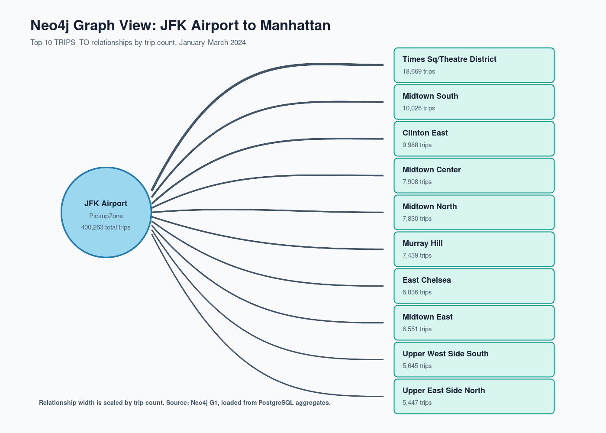

# Neo4j Graph Analysis

This document records the graph-layer validation and the results used in the
final report. All values come from the PostgreSQL export loaded into local
Neo4j on 2026-09-24.

## Loaded graph

| Item | Count |
|---|---:|
| `PickupZone` nodes | 265 |
| `DropoffZone` nodes | 265 |
| `PaymentType` nodes | 6 |
| `Vendor` nodes | 2 |
| `Month` nodes | 3 |
| `Hour` nodes | 24 |
| `TRIPS_TO` relationships | 33,304 |
| `PAID_WITH` relationships | 911 |
| `EARNED_IN` relationships | 6 |
| `HAS_PICKUP_DEMAND` relationships | 5,369 |

The graph contains 565 nodes and 39,590 relationships. It is therefore small
enough for direct exploration, while its relationship properties still describe
all 8,448,046 cleaned warehouse trips.

## Reproducible Browser visualization

After starting Neo4j and loading the graph, paste this query into Neo4j Browser.
It produces a focused, readable graph with one JFK Airport pickup zone and its
20 busiest Manhattan destinations:

```cypher
MATCH (pickup:PickupZone {zone: 'JFK Airport'})-[flow:TRIPS_TO]->
      (dropoff:DropoffZone {borough: 'Manhattan'})
RETURN pickup, flow, dropoff
ORDER BY flow.trip_count DESC
LIMIT 20;
```

Neo4j Browser can export the visible graph through the **Download as PNG**
control. The query is also stored as G1 in `neo4j/exploration_queries.cypher`.



## Findings

The graph queries identify these notable patterns:

- The busiest individual corridor is Upper East Side South to Upper East Side
  North: 61,421 trips, $958,770.89 revenue, 1.06 average miles, and 7.16
  average minutes.
- Midtown Center is the leading pickup hub by total outgoing demand with
  417,379 trips. JFK Airport is close behind with 400,263 trips, but generates
  much higher revenue ($32.88 million) because of longer airport journeys.
- Credit card is the preferred payment type for the busiest pickup zones. For
  JFK Airport alone, it accounts for 298,981 trips and $26.55 million revenue.
- The two vendors follow the same monthly pattern: their highest revenue is in
  March. VeriFone Inc. leads all three months by both trips and revenue.
- Midtown Center peaks at 18:00 with 38,697 trips; major Manhattan zones tend
  to peak in the late afternoon or evening, while airport zones peak earlier.

These findings complement the SQL OLAP results. SQL provides the full
dimensional analysis; the graph makes directional route relationships and hub
structure immediately visible.

## Validation commands

```bash
.venv/bin/python etl/export_neo4j_graph.py
docker exec -i nyc_taxi_neo4j cypher-shell -u neo4j -p taxigraph2024 \
  -d neo4j < neo4j/load_graph.cypher
docker exec -i nyc_taxi_neo4j cypher-shell -u neo4j -p taxigraph2024 \
  -d neo4j < neo4j/exploration_queries.cypher
```
