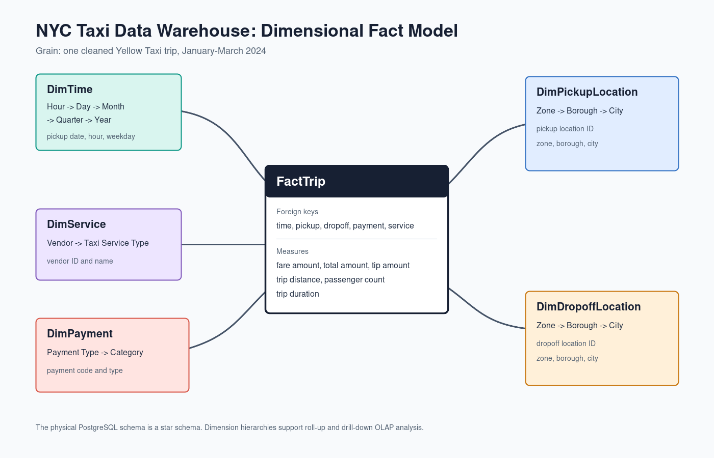
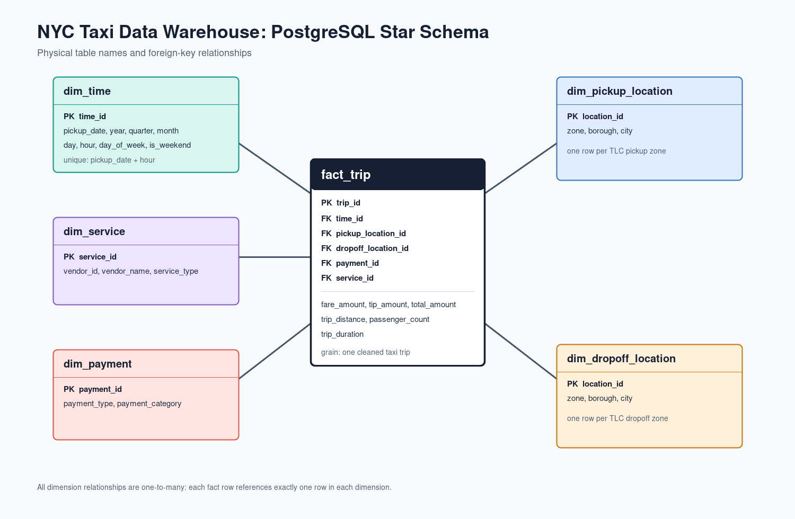

# NYC Taxi Data Warehouse and Graph Analysis Report

## 1. Objective

This project builds a data warehouse for NYC TLC Yellow Taxi trips and uses it
to analyse demand, revenue, payments, duration, and geographic movement. The
core deliverable is a PostgreSQL star schema with OLAP queries. Neo4j replaces
the proposal's optional Power BI/Tableau component as a graph-analysis and
visualization layer.

## 2. Dataset and preparation

The source is the NYC TLC Yellow Taxi Trip Record dataset. The project uses
January, February, and March 2024 Parquet files plus the TLC taxi-zone lookup.

| Stage | Trips |
|---|---:|
| Raw records | 9,554,778 |
| Cleaned records | 8,448,046 |
| Removed records | 1,106,732 |

The cleaning process removes trips with missing timestamps or locations,
out-of-scope pickup dates, non-positive or implausible fare/distance values,
invalid passenger counts, and durations outside one to 300 minutes. Missing tip
amounts are set to zero. These controls make the resulting measures suitable
for aggregation while preserving 88.4% of the original trip records.

## 3. Warehouse design

The warehouse grain is one cleaned taxi trip per `fact_trip` row. Its measures
are fare amount, tip amount, total amount, trip distance, passenger count, and
trip duration. Five dimensions support the proposed hierarchies:

| Dimension | Hierarchy |
|---|---|
| Time | hour -> day -> month -> quarter -> year |
| Pickup location | zone -> borough -> city |
| Dropoff location | zone -> borough -> city |
| Payment | payment type -> payment category |
| Service | vendor -> taxi service type |

The physical implementation has 2,183 time rows, 265 pickup locations, 265
dropoff locations, six payment types, two vendor services, and 8,448,046 fact
rows. The corresponding key relationships are shown below.

## 4. ETL implementation

The ETL pipeline is implemented in three Python scripts:

- `etl/download.py` obtains the TLC source files and the zone lookup.
- `etl/clean.py` applies data-quality rules and writes cleaned Parquet files.
- `etl/load.py` loads dimensions first and bulk-loads fact rows to PostgreSQL in
  100,000-row batches.

The dimensional load assigns one time row per pickup date and hour, derives
calendar attributes, maps TLC payment codes and vendor IDs, and loads lookup
zones into separate pickup and dropoff dimensions. PostgreSQL foreign keys and
checks enforce the star-schema contract after loading.

## 5. OLAP analysis

The 12 queries in `sql/olap_queries.sql` provide roll-up, drill-down, slice,
dice, ranking, and window-function analyses. They cover time demand, revenue,
pickup geography, duration, cash payments, trip length/payment combinations,
high-demand zones, tipping behaviour, borough peak hours, and vendor revenue.

The result sets are reproducibly exported by `etl/export_olap_results.py`.
Their row counts and warehouse validation checks are documented in
`docs/validation.md`.

## 6. Neo4j graph analysis

Neo4j is intentionally a derived layer. The script
`etl/export_neo4j_graph.py` groups PostgreSQL facts into route, payment, vendor,
and hourly-demand aggregates before loading Neo4j. It avoids modeling more than
8 million trip nodes while retaining the measures needed for exploration.

The loaded graph contains 565 nodes and 39,590 relationships. Its main
relationship types are:

- `TRIPS_TO`: directional pickup-to-dropoff corridors;
- `PAID_WITH`: payment patterns by pickup zone;
- `EARNED_IN`: vendor revenue by month; and
- `HAS_PICKUP_DEMAND`: pickup-zone demand by hour.

The strongest individual corridor is Upper East Side South to Upper East Side
North, with 61,421 trips and $958,770.89 in revenue. Midtown Center is the
largest pickup hub by trip volume (417,379 trips), while JFK Airport produces
$32.88 million across 400,263 trips because airport trips are longer. Credit
card is the dominant payment method at the busiest pickup zones. Both vendors
reach their highest revenue in March, and Midtown Center has its peak demand at
18:00.

These results are reproducible from `neo4j/exploration_queries.cypher`. G1
returns a focused JFK-to-Manhattan graph suitable for Neo4j Browser's graph
view. The complete counts, commands, and findings are in
`docs/graph_analysis.md`.

## 7. Interpretation

PostgreSQL and Neo4j answer complementary analytical questions. The star
schema provides complete and auditable dimensional aggregates, while the graph
makes route direction, hub structure, and relationship properties easy to
inspect visually. This split keeps the solution aligned with the warehouse
requirement and uses Neo4j where it has a clear advantage.

## 8. Conclusion

The project fulfills the proposed warehouse work: source data was acquired and
cleaned, a PostgreSQL star schema was implemented and populated, and 12 OLAP
queries were executed and exported. The final package now also contains the DFM
and ER diagrams, an executable Neo4j graph extension, documented graph
findings, and reproducible commands for a project demonstration.
